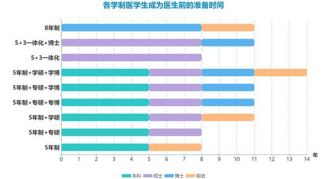
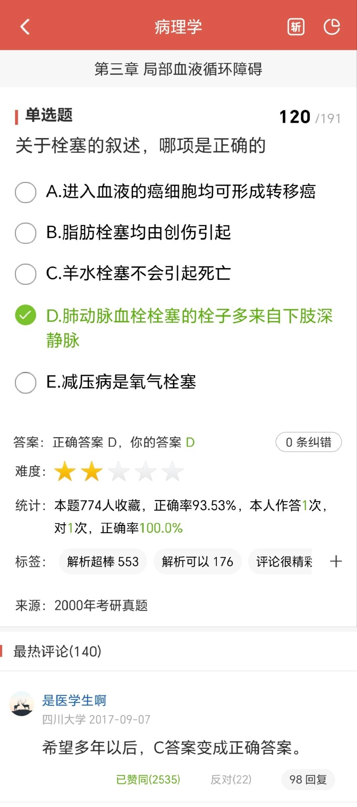

# 1002 临床医学

**学校：** 首都医科大学

**专业：** 临床医学阶平班

**邮箱：** [Acetylcholine@foxmail.com](mailto:Acetylcholine@foxmail.com)

**QQ：** 81077827

## PART1 临床医学综述

### 起点之前——为什么选择学医？

私以为在决定走进医学大门（以及其他任何专业）之前，应该拷问自己为什么选择这一行。也许是为了毕业后谋求一个稳定的工作，也许是对人的健康与疾病发生充满好奇，也许是因为医学“救死扶伤”的性质而持有崇高的敬意，再或者是看了几部医疗剧或者纪录片觉得白衣天使实在是太酷了，这些都可能是学医的动机。我无意讨论哪种动机更好，只是希望各位在决定学医之前确认“我的热情是否足够支持自己一路达到目标”：学医（其实其他专业也一样）在我看来是一个不断祛魅的过程，当忙碌的期末月、规培、学阀、不遵医嘱的患者、医闹事件等等一次次地打碎原先的滤镜，此时再后悔入行也许为时已晚。当然，刚刚只是在罗列医学从业者会遇到的阻碍，所以有读者觉得我在劝退也无可厚非，但学医未必是时时刻刻都在消磨当初的热情的，患者痊愈、实验成功或者一作Nature见刊等等都可能重新点燃当初的热情。无论怎么讲，只要有自信可以时时怀揣对学医的热情，那就可以默念几句“优势在我”，然后大胆地选吧。

### 起点——专业选择

如前辈们所说，若要成为西医医生，除非是上交或协和的“4+4”，否则只能填报口腔医学和临床医学及其下属的本科专业，其中临床医学一级学科下属有临床、麻醉、影像、眼视光、精神、放射、儿科共7个本科二级学科，需要注意后6个二级学科考研专业可能受限制；临床医学和口腔医学两专业之间也不能跨考研究生或执医证，因此若想当口腔科医生只能选择口腔医学，想主刀神经外科手术请报考临床医学。

### 道阻且长——学制、修业时长

先解释学制：临床医学本科学制为5年，部分头部医学院校会开设长学制（本硕连读、本博连读等等）。填报志愿时，常见学制有五年制本科（授予医学学士学位），“5+3”一体化（本硕连读，授予医学学士学位和专业型硕士学位），八年制（本博连读，授予医学学士学位和博士学位，注意八年制不授予硕士学位），其他学制（如华科启明、协和4+4、中国医大红医班、首医阶平班等）请参考各校官网招生简章。“5+3”和八年制虽然都是八年，但授予的学位和培养模式都不同，填报时请仔细甄别。

医学的修业时长比较漫长，从开始读本科到正式上岗最少需要约8年的时间（5年本科+3年规培）。这里就不得不引出规培这个概念——住院医师规范化培训，为期3年，目的在于“使每个医师都具有全面的临床能力”，虽然实际执行有较大概率与规培本意背道而驰。一般地，完成规培后才能正式上岗。在上文提及的“5+3”中，3年专硕是并轨规培的；在五年制本科后考研、保研而成为的专硕，也是和规培并轨的；但单独的规培不授予专硕学位。“5+3”实际上是“四证合一”——除了上文提到的学士学位证、专业型硕士学位证、规培证，毕业时还会考取执业医师资格证（执医证），8年毕业后可上岗。

虽然理想状态下8年即可上岗，但是现在的用人单位对学历的要求越来越高，顶级三甲往往要求求职者拥有博士学位，此时再成为医生持证上岗需要至少11年时间（八年制+规培或专硕+博士）。若是科学型硕士（学硕）读博，博士毕业后仍旧需要花3年时间规培，此时修业时长来到了十四年。下图为一个图片综述。

  

>  Fig.1 图片综述：学制和修业时长

### “你这十一年都学了些什么”——培养计划和核心课程

以较为常见的本科-专硕-博士为例，一个医学生会经历这样的十一年：

本科阶段：前2-3年会在校园里度过，这几年会有通识课（计算机、数学、物理）、专业基础课（四门化学、三理一化——生理病理药理生化、解剖组胚、寄生虫、微生物、遗传、免疫……）以及相应的实验；到三四年级时，会在临床医院里学习专业核心课程（内外妇儿等等），在教学医院进行见习课程，开始接触临床；到了五年级则是临床实习，选择考研的同学这一年则会在实习期间备考。

专硕并轨规培阶段：在各个主要科室进行为期33个月的轮转，全面掌握临床工作基本技能。一般来说，研究生阶段是选定执业科室的时期，比如考取或推免成为了神经病学的硕士研究生，将来的执业范围则限定在神经内科。

博士阶段：做实验、发文章，完成博士学位论文，通过答辩后将成为一位真正的Doctor！

## PART2 就读体验——首都医科大学临床医学阶平班

### 概述：

阶平班是首医自2021年始设立的本科专业，综述中提到过阶平班算是“特殊学制”。众所周知，首医在临床医学专业虽有不俗的实力（参考ESI、第四轮和第五轮学科评估、医学界®医学院校排行榜等等），但不知为何没有拿到八年制办学资格，只有“5+3”的办学资格。但只要思想不滑坡，办法总比困难多，在北京市（首医是市属学校）的支持下，学校开设了本科直博专业“阶平班”，学制“5+X”（本科5年，X指研究生培养阶段约为3年，毕业时授予学士学位和PhD博士学位）。

### 课程与培养方案：

基本课程前文已经介绍过，不过阶平班会在前两年花更多时间学习数学、物理这样更加基础的学科，旨在培养科学思维（或许）。二年级开始即可开始思考自己将来想从事的科室，并进入心仪导师的课题组学习，在二年级将结束时正式签约（一个学生拥有临床医学和基础医学双导师）；最早允许在三年级第二学期进行博士课题开题。需要注意的是，秉持着“先成为科学家，再成为医生”的培养目标，博士课题是偏基础医学方向的，比如研究一个受体的作用等等。在完成四年级的临床课、五年级的实习后，研究生阶段大部分时间都需要在实验室钻研博士课题，为人类的知识“拓荒”。

### 误解：

当我听闻校方对我们的培养目标是“先当科学家”的时候我有所不解和震惊，毕竟我是怀着成为医生的期盼填报的这条志愿，谁知道小时候“想当科学家”的遥远愿望竟阴差阳错地以这种方式变得不再遥不可及。换个角度想，从分子、细胞的基础研究重新理解并促进人类的健康，或许和做白求恩式的医生同等高尚。

 

> Fig.2 期末月虽然总是令人破防，但总有人不忘“除人类之病痛，助健康之完美”的誓词，让同学们重新燃起希望的火苗，令人热泪盈眶。（图截自医考帮APP）

### 就读体验：

不卷、不内耗！阶平班的淘汰机制非常友善，不搞末位淘汰；挂满三科或者补考挂科才会失去直博资格。在不挂科的前提下，你可以选择任何喜欢的方式度过大学生涯：阶平班允许0出勤率，除了英语和实验课，因此即使哪天排满了课也能全部翘掉，泡图书馆看小说、在实验室做课题、或是玩乐队等等，不会因为缺勤太多而被取消考试资格。资源丰富，可选的博导极多，包括院士如吉训明、赵继宗等等，不一一列举；近两年在北京市支持下设立了新型研发机构——首医创新中心，经费充足未来可期；常有各类学术报告，报告主讲席偶尔刷新诺奖得主。同时由于免去了考研保研的压力和末位淘汰的内卷，学风良好且氛围融洽和睦。但期末考试有可能背刺你的直博愿望，期末月时不可不紧张起来（众所周知医学生的期末并不好过，更何况是在一个线代和物理都挂人的地方）。

### 去向：

或许需要待21届的前辈们毕业之后再更新，让我们拭目以待吧。至于本校“5+3”，鉴于首医遍布全北京的附属医院，读博后留京的机会不少。至于收入参考前几篇前辈的叙述。

---
**专业：** 019临床医学（八年制）  
**学校：** 北京大学  
**主要课程：**  
数理化信基础与人文通识课程  分子-细胞课程  
器官-系统课程  
环境-社会课程  
二级学科  

首先声明两点，一是填报医学院并非成为医生的充分条件：如果想成为一名医生，请务必选择临床医学、口腔医学这两个专业（中医另说）。因为根据我国现行法律法规，除非走协和/上交4+4，本科非这两个专业不允许参加执业医师资格考试，也就无法拿到行医执照；二是选择临床/口腔专业也并非意味着你只能当医生，功利的说我觉得八年制临床学下来要比其他专业的博士就业要好很多，离开临床依然有非常多的选择，有一句话叫做学临床不一定做临床，交叉思维非常宝贵，各行各业都需要有临床思维的跨学科人才。

选择临床（尤其是临床八年制）的优点包括博士学历、社会地位高、受人尊敬、工作十分有意义、职业成熟后收入可观、治病救人的成就感、对家人的正向福利；坏处包括期末考试十分死亡、培养周期长、工作十分辛苦、需要值夜班、医患关系紧张等等。口腔医学可以理解为临床一个比较好的方向（虽然这两个是平级的专业），其好处除了和临床一样的博士、社会地位高、受人尊敬、工作十分有意义、治病救人的成就感、对家人的正向福利、职业成熟后收入可观之外，还加上不成熟的时候收入也比较可观、工作比临床轻松多了、不需要（极少需要）值夜班、医患关系和谐等。口腔医学的坏处可能是期末考试比较死亡、培养周期长，名牌院校招生更少（以及分高）。

值得注意的是，在糟糕的经济形势下，临床和口腔医学在就业上的稳定性是十分有竞争力的。我个人觉得如果能考到顶尖医学院校读临床是一件很值得的事情（前提是你有兴趣），达则留北京上海走向人生巅峰，穷则回同济协和，也比武大华科有竞争力。如果依靠临床背景去做其他行业的工作，例如搞金融，P大的临床可能比某些非TOP2的经济系在医药投资领域更有竞争力（不过是这几年医药研究员是比较缺，八年后不好说这个行业是什么样了，不过最起码临床还能正常当医生不是）。

---

**专业：** 020临床医学（八年制）  
**学校：** 北京大学  

联系方式：h200233333@stu.pku.edu.cn

首先需要再次强调的是，传统意义上我们习惯把【学医】等效为【当医生】，但正如前一篇分享所说，只有【临床医学】和【口腔医学】这两个专业是有行医资格的。而大多数医学院校，以北京大学医学部为例，除此之外还有着种类繁多的专业：基础医学，药学，预防医学等等。所以请大家在填报志愿的时候多多注意。

本文主要想回答的问题是：怎样判断你是否适合当医生？

这看起来简单弱智，但其实是不少临床医学专业的同学需要用一生去思考和回答的问题。我相信绝大部分选择或准备选择这个专业的同学，自己和家人都预期着在未来成为一名临床医生。但大一下学期我们班请来附属医院的医生做班会分享，他们上台之后问的第一句话便是：请大家想清楚，自己是不是真的想要成为一名医生，随即展开了半个小时的分(quan)享(tui)行动，令人印象深刻。

正如前文所说，临床医学是为数不多具有行医资格的专业；然而，这个专业的转行率依然不低。根据2018年的数据，北医的临床八年学子有60%最后当了医生，换言之高达40%的同学因各种原因并没有坚持自己的行医之梦。当然，即使不当医生，八年制的医学博士在其他行业也同样大有可为。无论是从政、转投行亦或是人工智能结合，都有不少前辈选择，大家如果有类似想法也可以去参考其他专业的指南。不过本文还是以从医为重。

 

**你为什么选择不当医生？**

首先，从个体角度出发，你要做好吃苦的打算。大学的专业课给我的感受就是，每天排6-8个小时的高中生物课，每天下课后还得重复背书。你会拥有比其他专业的同学枯燥与乏累许多的大学生活，从而被迫减少你的社交时间，这对于不少长于社交的同学是很痛苦的。

更重要的是，这份劳累可能是终身的。医学对学历的看重远过于其他学科，博士几乎已成为标配，博士后亦有欣欣向荣的趋势。十几年苦读结束后你作为一个任劳任怨的实习医生拿着微薄的工资，而你学金融计算机的同学或许早已有车有房。这份“不平衡”无疑让不少人怨声载道。

而工作后，医生的忙碌程度也同样声名远扬。医生需要做的，不仅仅是给病人看病而已。你还需要在科研上投入大量精力，否则没有论文产出的你难以晋升职称；你还需要承担被分派下来的教学任务，去给一群会让你内心os怎么这么笨的临床学生带教。（倒）每当我觉得自己生活又苦又累难以为继的时候，一想到我的导师比我更苦更累还那么拼，就觉得自己没有摸鱼的理由了。。

最后同样不得不提及的是大陆的行医环境。如何看待大陆 36 名状元无一人学医，而香港 6 名状元全部学医的现象？ - 知乎https://www.zhihu.com/question/298021703；这样的现状或许能为我们提供一些线索。薪资待遇、医闹、过长的培养周期、行业机制等等都长期受到质疑，“劝人学医，天打雷劈”的俚语流传甚广。尽管新冠疫情让内地医生的冷门状况得到了一定程度的缓解，但高分层的“学医冷”依然是不可忽视的。

右图：2022高考结束后，豆瓣大学后悔学医小组登上热门趋势榜

**那么，你为什么选择当医生？**

我第一次确切地产生学医的想法，是高中在政治课上观看纪录片《人间世》。清晰的、直接的手术画面让我的不少同学不忍直视，但我却看得十分入迷。治病救人四个字，本身似乎就有着难以名状的魅力。为一场疾病、一个衰竭的器官、一条垂危的生命、一个康复的可能而竭尽全力。这从来不是一条坦途，但总有人愿意为之披荆斩棘。

如果说每个职业都对应着一场战役，有的胜利可以赚取大把金钱，有的胜利可以换来摸鱼空闲，而医生的胜利可以真真切切地改变其他人的人生。我从大二开始去医院门诊跟着导师学习，的确在社会大学见到了不少人情冷暖，但病人眼中发自内心的信任与感激会永远是这份职业带给我最大的体验感和前行动力。

这种体验感听起来玄乎其玄，但真正到达临床实践中，它的重要性是不可忽视的。记得一位社团里的学姐和我们分享她在跨年夜蹲守一个危重双胞胎孕妇的经历。长达四个小时的手术，新的一年在不知不觉中到来；但走出手术室为门外的家属报喜的那一刻，每个人都觉得无比值得。她眉飞色舞地为我们讲述手术中每一个关键的节点、每一个揪心的细节，最后心满意足地说，这是她度过最难忘的跨年夜。

我理解她。

我不否认这份职业的艰辛，但也确实有必要为前文的劝退理由说几句公道话：

作为大后期的职业，医生在职业稳定后的收入依然是可观的。虽然不可能大富大贵（除非你成为了该行业国内首屈一指的外科大夫人人争着找你做手术），但在你所在的城市一定有着相应的中游的收入和上游的社会地位。

医生的劳累程度远近闻名，但在当前就业形势下，有的行业熬夜更狠赚的更少，有的行业疫情一闹收入折半，能旱涝保收实属不易。除此之外，辛苦程度也同样有科室的分别：有的科室熬大夜破大防，也有的科室乐得清闲、佛系养生。“医闹”令人寒心、震惊，但一方面医院的安检系统正在不断加强，另一方面社会面的呼吁声浪也逐渐形成共识。

而至于那句“劝人学医，天打雷劈”，我的理解是：**不要因为自己恰好考了某个分数，为了“让分数发挥最大价值”而学医。**希望最终决定的你对医学专业有着充分而深入的了解，对前途的坎坷和收获都有心理准备，然后做出最适合自己的选择。

最后，以经典美剧《实习医生格蕾》第一季第一集主人公的独白结尾吧：

I can't think of any one reason why I want to be a surgeon,but I can think of 1000 reason why I should quit. They make it hard on purpose. There are lives in our hands, there comes a moment when it's more than just a game, and you either take that step forward, or turn around and walk away. I could quit, but here's the thing. I love the playing field.

欢迎你，在深思熟虑之后，加入这场playing field。

---

**学院：**基础医学院  **专业：**临床医学-18级  **学校：**华科  

 

**前两年的通识课程（并没有核心课程）：**  微积分，概率论，线性代数，无机化学，有机化学，物理化学，细胞生物学  **第三年和第四年的通识课程（基础医学课程）：**  生理学、生化、系统解剖学、局部解剖学、疾病总论和各个系统（消化系统、神经系统、内分泌系统等等）；以及各种公卫课程，如医学统计学、医学心理学、流行病学等  

**误解与感受：**

最大的误解可能就是出于对医生这个职业的理解上，其实没有想象的那么厉害，治病救人等等，起码在8年毕业+3年博后+2-3年规培后，才真正开始走上行医的道路，而前期的者10多年大部分都是学习+科研搬砖，所以可能会和想象中的白衣天使有一定出入。

作为八年制本硕博贯通培养，本身是一种节约时间的选择，但个人认为前2年的培养模式有些多余，虽然本身的出发点是为了培养学生的综合素质，但这些会在20级有所调整，缩短至1年。不过在主校区的2年应该算是这八年中最轻松最有意思的日子。

在大三搬到同济后，生活节奏就会快起来，学业压力还是比较大的，课程比较多，需要背记的也很多，特别到考试月，一直需要去背记知识点。但是在学有余力的时候，推荐拓展一些视野，多多去基础医学院的实验室学学各种基本实验操作，或者跟着公卫学院的老师学学R语言和临床研究等等，为后续进入临床，选导师后进行的科研打好基础。

其实本专业的学习压力是可大可小的，如果想获得各种奖学金，就要非常努力学习，但因为没有保研和考研的压力，所以如果佛系一些，还是可以过得比较轻松的。

​	

**去向：**

八年毕业后，大部分都是留在三甲医院，当然同济协和的留院难度比较大（特别是同济），如果在大五以后的科研阶段做出了比较好的成果，发了影响因子比较高的paper，医院甚至会抢着要你的。然后还有一部分会选择自己出国修2年博后，再回来留院，这时候留院会比较轻松。